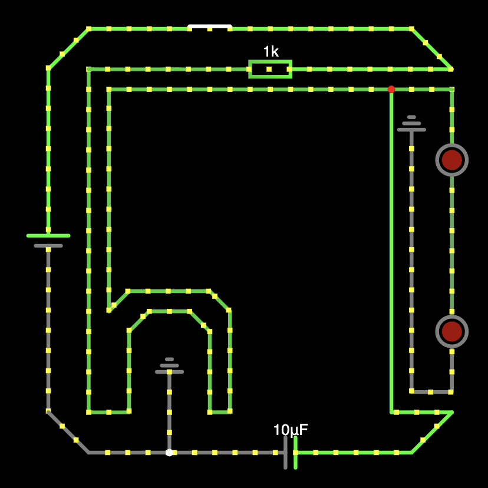

# Resolution Coding Hardware Pathway

I'm building my hardware skills slowly because of concerns for losing job opportunities in computer science due to artificial intelligence and vibe-coding.

---

## 3/15/2026 - [Week 1 Submission]

Today I worked on the circuit for the first week of resolution coding.

I ran into some issues due to being thrown off by the prompt. 
However, I resolved them by talking to ChatGPT & consulting the LLM on definitions; it attempted to give to much help but I only focused on the definitions.

### Time Spent: 0.2 Hours

---

## Date - [Heading]

Today I fixed the X issue by doing Y.

### Time Spent: X Hours
