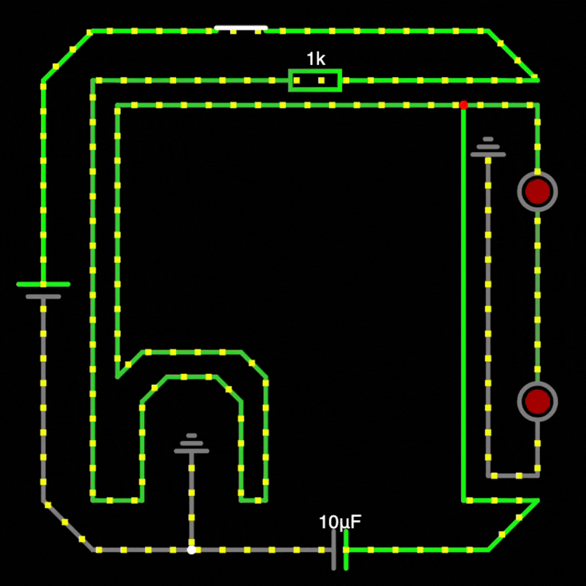

# Resolution Coding (Hardware Pathway Submissions)

## Week 1

### Project Description
The Circuit is a flow of energy to light up 2 LEDs in the wire shape of a Hack Club logo. (The lowercase "h".)

### Demo

> [Demonstration Link (Falstad)](https://is.gd/UzqL1f)

### Circuit Description
> The Circuit begin at a 2 Terminal Voltage Source flowing into a Wire that leads to a Switch.
> The Switch is connected via Wire to a Resistor.
> The Resistor bridges to both the LEDs and a Capacitator through wires.
> The LEDs lead to one of 2 GNDs. The Capacitator also leads to another GND. (Leading to via Wires again.)
> The Capacitator also reconnects back to the 2 Terminal Voltage Source via Wire. (Completes the Circuit's flow.)

#### Signed by Ananta the Developer
